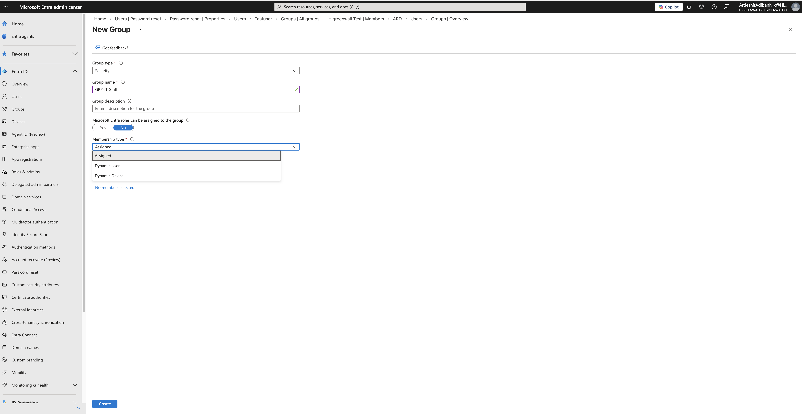
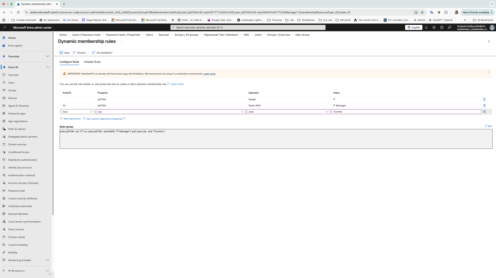
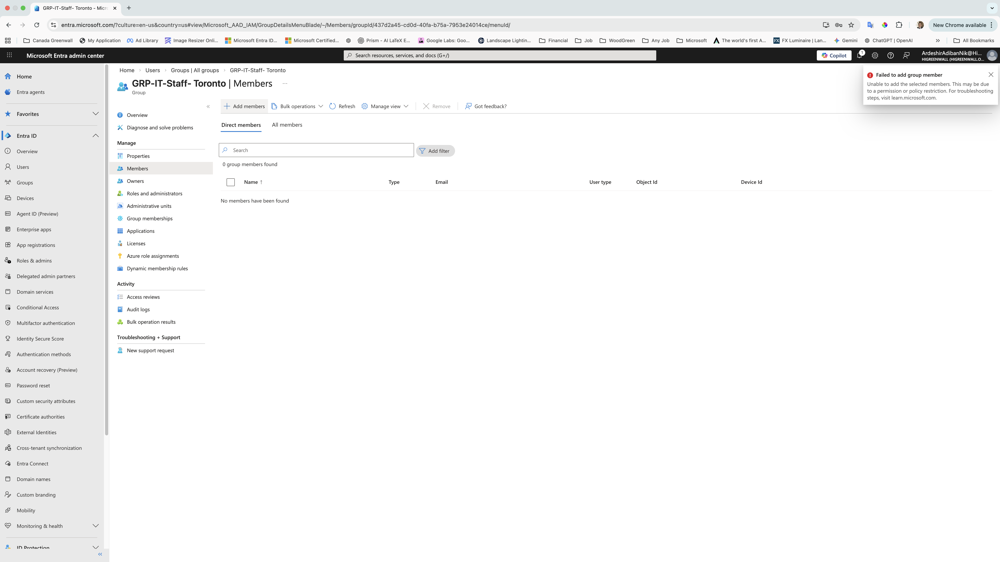

# Microsoft Entra ID: Dynamic Group Automation & Troubleshooting

## Introduction
As an IT Professional with over 15 years of experience in infrastructure and support, I am currently specializing in Cloud Administration and preparing for the Microsoft Azure Administrator (AZ-104) certification.

This project demonstrates my ability to implement Attribute-Based Access Control (ABAC) within Microsoft Entra ID (formerly Azure AD). By moving away from manual user assignments to Dynamic Membership Groups, I've showcased how to streamline IT operations, reduce human error, and ensure that access is automatically granted based on a user's organizational role and location.

Problem Statement
Manual group management is inefficient and prone to security risks in growing organizations. For instance, in a company like Greenwall Companies, where I manage IT and project coordination, ensuring that only the right staff (e.g., IT personnel in Toronto) have specific access is critical.

Technical Implementation
In this repository, you will find a step-by-step walkthrough of:

Dynamic Group Configuration: Building complex logic using Rule Syntax.

Error Analysis & Troubleshooting: Investigating "Policy Restrictions" when manual overrides are attempted.

Identity Life-cycle Management: Automating the onboarding process by mapping user attributes (Job Title & City) to group memberships.

## Step-by-Step Implementation

### 1. Group Configuration
I created a Security group with a **Dynamic User** membership type to automate onboarding.

### 2. Defining Membership Rules
The rule ensures only users with the title "IT" in "Toronto" are added.
- **Rule Syntax:** `(user.jobTitle -eq "IT") and (user.city -eq "Toronto")`

### 3. Troubleshooting Manual Assignment Errors
When I tried to manually add a user, I encountered a policy restriction error. This confirms that the Dynamic Rule is governing the group correctly.

## Conclusion
This project highlights the efficiency of Cloud Identity Management over traditional, manual methods. By implementing Dynamic Membership Rules, I demonstrated how to enforce organizational policies automatically, ensuring that user access remains accurate and secure as employees change roles or locations.

The troubleshooting phase of this project was particularly valuable. It confirmed that the Microsoft Entra ID policy engine was successfully preventing manual overrides, which is a core security feature in enterprise environments. These technical skills are central to my ongoing work as an IT & Project Coordinator and my preparation for the AZ-104 certification.
